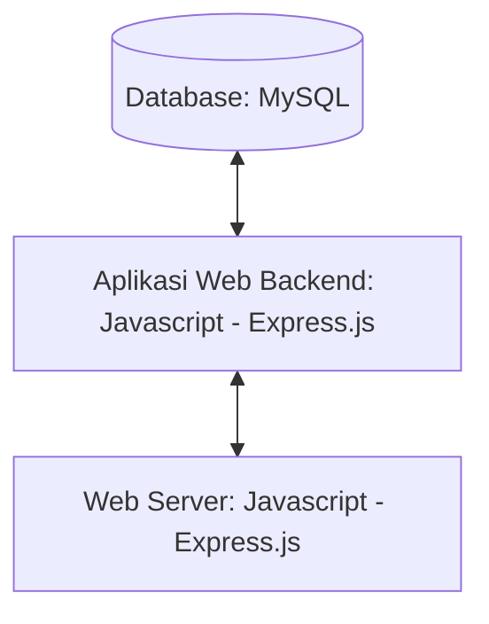

## 1.1 Latar Belakang

Disini saya akan membuat website bisnis yang bertemakan E-commerce. Dan yang menjadi alasan saya membuat E-commerce ini adalah agar kita bisa melakukan perdagangan serta pembelian secara mudah dan simpel dengan melalui sistem elektronik
     
Proses Pembangunan Teknologi Informasi secara umum mengikuti Web Development Life Cycle :

   - Analysis

     Analisis adalah tahapan ketika kita mencoba menganalisa website seperti apa akan dibuat

   -	Design

    	Setelah itu saya akan mencoba mendesain sketsa dari website saya, kemudian didesain dengan saya gambar agar memudahkan penggambaarannya

   -	Development
     Setelah desain dan menentukan teknologi apa saja yang akan digunakan, kemudian saya akan mencoba mengaplikasikan desain tadi ke kodingan. Mulanya saya akan membuat struktur dasar menggunakan HTML, kemudian diberikan style menggunakan CSS,dan JavaScript

   - Testing & Review

     Setelah ketiga tahapan tadi, website yang sudah hampir selesai ditest terlebih dahulu, diperiksa semuanya dan dicari kesalahannya bila ada. Setelah itu saya mencoba meminta review ke orang lain untuk memberikan pendapat dan kritik mereka guna mempermudah saya menemukan letak kesalahan saya bila ada.

   - Deployment

     Setelah website saya dipastikan sempurna dan tidak ada kesalahan, juga sudah mendapatkan review yang baik, maka saya akan upload websitenya di akun github saya, yang kemudian akan saya posting ke internet. Sehingga website saya bisa diakses melalui internet.

   - Maintenance

     Setelah berhasil mengupload websitenya, sekarang tinggal tahapan maintenance. Setelah mendeploy website untuk beberapa hari, saya akan mencoba cek apakah ada kerusakan atau pun kesalahan ketika mengakses website saya dari internet browser.

## 1.2. Deksripsi Teknologi Informasi

Didalam website ini akan terdapat homepage tentang landing page toko saya

•	Merk = Frazx (Terinspirasi dari "Nama saya sendiri")

•	Tagline = "Great Product Great Service"

•	Campaign = Bagaimana membuat website yang menyediakan info bagi pembeli tentang bisnis E-Commerce, maupun melakukan transaksi secara online agar memudahkan pembeli

•	Target User :

    o	Usia 15+
    
    o	Orang yang ingin membeli barang elektronik
    
    o	Orang yang ingin melihat referensi E-commerce
    
    o	Orang yang suka membeli barang secara online
    
       
    o	Orang yang ingin melihat productnya sebelum datang ke toko
    
    •	User Experience :
    
    o	Mudah
    
    o	Menarik
    
    o	Sederhana
    
    o	Menginspirasi
    
    o	Warna : warna orange, background biru

- Inspirasi Desain :

## 2. User Story

Sebagai | Saya ingin bisa | Sehingga | Prioritas
---|---|---|---
pengguna | melihat daftar produk tersedia | bisa memilih produk yang tersedia disetiap toko | ⭐⭐⭐⭐⭐
Pengguna | Mengklik "add to cart" | Bisa menambahkan produk ke shopping cart | ⭐⭐⭐⭐⭐
Pengguna | Mengklik Navigation Bar di ukuran kecil | Lebih rapih dan tidak berantakan | ⭐⭐⭐
Pengguna | Mengklik Detail Product | Bisa memunculkan detail product | ⭐⭐⭐⭐⭐
pengguna | Membeli produk | bisa  membawa pulang produk yang dipilih  | ⭐⭐⭐⭐⭐
pengguna | Menghapus produk dari cart | bisa  diganti dengan produk lain | ⭐⭐⭐⭐
pengguna | melihat review produk | bisa melihat feedback dari yang sudah pernah pesan | ⭐⭐⭐

## 3. Struktur Data

Cara membuat aneka macam bentuk grafik menggunakan mermaid.js bisa lihat di [https://mermaid.js.org/syntax/entityRelationshipDiagram.html](https://mermaid.js.org/syntax/entityRelationshipDiagram.html) 

```mermaid
---
title:  Frazzx Shop
---
erDiagram
    kategori ||--o{ produk_galeri : produk kategori {
        int id PK
        varchar nama
        varchar slug
} produk_galeri ||--o{ produk : view produk_galeri {
        int id PK
        varchar photo
        int produk_id
} produk ||--o{ keranjang : places produk {
        int id PK
        varchar nama
        int users_id FK
        int harga
        text deskripsi
        int kategori_id FK
} keranjang ||--|{ pengguna : save keranjang {
        int id PK
        int produk_id FK
        int users_id FK
} pengguna ||..|{ transaksi : procces pengguna {
        int id PK
        varchar nama
        varchar email
        varchar password
        text alamat_1
        text alamat_2
        int provinsi_id
        int kabupaten_id
        int kode_pos
        varchar negara
        varchar nomor_telepon
        varchar nama_toko
        int kategori_id FK
        int status_toko
} transaksi }|..|{ detail_transaksi : payment transaksi {
        int id PK
        int users_id FK
        int harga_diskon
        int harga_pengiriman
        int total_harga
        varchar status_transaksi
        varchar resi
} detail_transaksi {
        int id PK
        int transaksi_id
        int produk_id
        int harga
}

    
```

## 4. Arsitektur Sistem

Masih pake mermaid.js juga bisa lihat flowchart di [https://mermaid.js.org/syntax/flowchart.html](https://mermaid.js.org/syntax/flowchart.html)

## 5. Teknologi, Library, dan Framework

di project ini saya menggunakan Visual Studio Code sebagai teknologi pendukung saya, serta saya menggunakan font awesome sebagai media saya untuk mengambil icon
lalu untuk library serta framework saya menggunakan Bootstrap dan React js

## 6. Desain User Experience dan User Interface

  
1. Ini adalah desain ui page website saya

 Ketika kata Product di klik

ketika kata contact di klik 

## 7. Demonstrasi Video

Link youtube nya

## 8. Bagaimana mesin komputasi dan sistem operasi berperan dalam produk teknologi informasimu ?

Link youtube nya di detik jawaban ini

## 9. Bagaimana algoritma, struktur data, dan bahasa pemrograman berperan dalam produk teknologi informasimu ?

Link youtube nya di detik jawaban ini

## 10. Bagaimana metode pengembangan perangkat lunak / Software Development Life Cycle berperan dalam produk teknologi informasimu ?

Link youtube nya di detik jawaban ini

## 11. Bagaimana database / sistem basis data berperan dalam produk teknologi informasimu ?

Link youtube nya di detik jawaban ini
